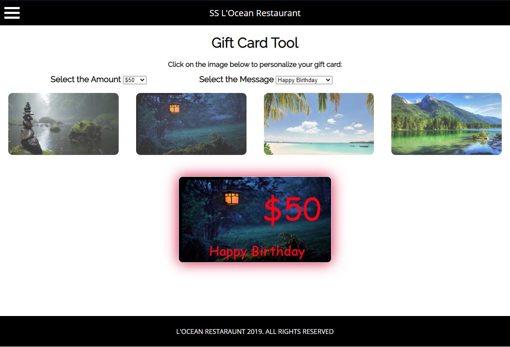
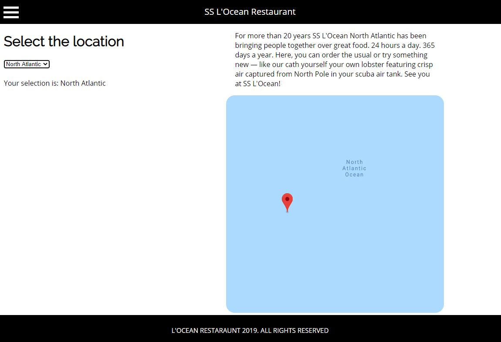

# Restaurant
JavaScript Project. Website for fictional Restaurant, which is located on the boat in the middle of the ocean 

In this team project, we were given a task to create a website using only simple JavaScript, HTML and CSS, no frameworks, no outside scripts. My part was to developed two pages: Gift Cards and Locations. Even though looking back at the code now and seeing how much I can improve it, I am still very proud of this project, because it was truly the first time I worked in a team on a fairly large project. To be successful as a team we communicated on a daily basis and used GitHub to collaborate and put our code together.  

One of the pages I created was a Gift Card selector. I wanted to make it somewhat more interesting than just a list of possible designs and values. So, I decided to make it interactive, I made a form where user can select a message, select a value, and choose the design of the card, and later see how it all looks together. One of the challenges was to properly position the value and the message within the final Gift Card, which required learning more CSS. Also, I wanted to make sure that if the users want to modify the Gift Card, they can do it without reloading the page, this required learning better techniques in JavaScript, and completely re-write my code.

Another page I created was the Locations page, similarly to the gift card page, I did not want to have a simple list of locations, I wanted to have at least a minimal level of interaction between a visitor and the page. I did not use Google API to show locations (at that time I did not even know what it is), but I knew I wanted to make it similar to what I have seen on other pages. I created a screenshot and made that screenshot a link to the point on google maps. 

